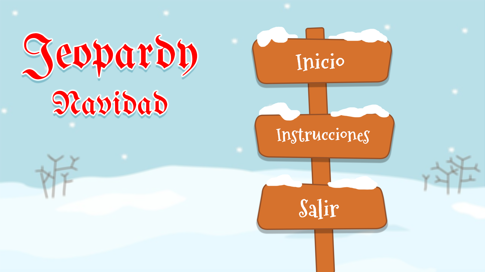
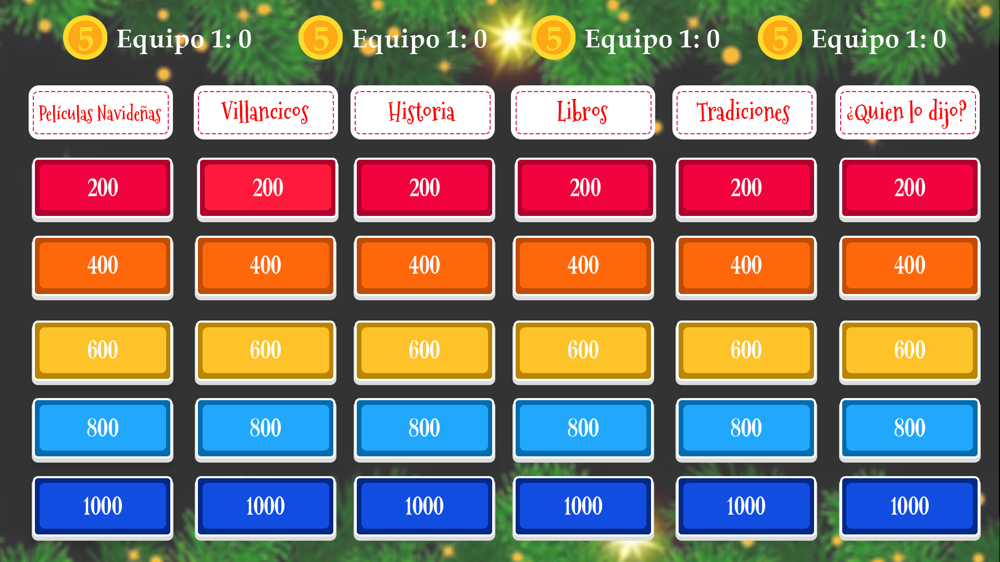
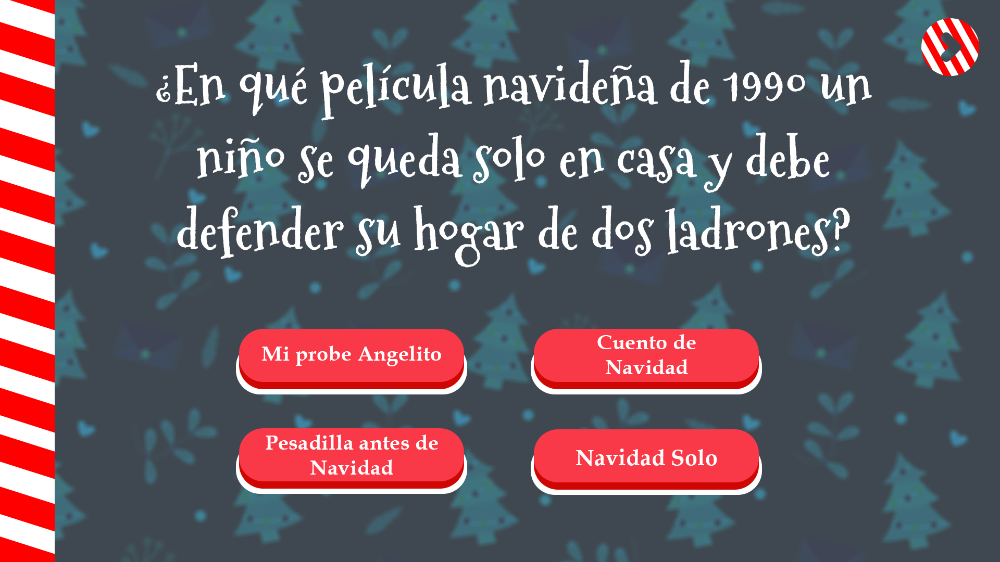
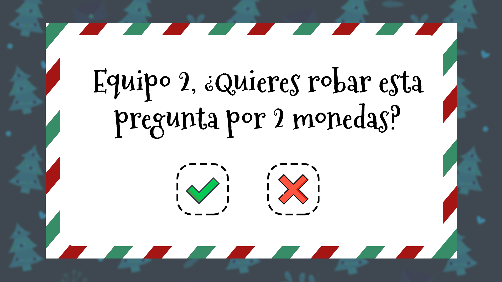
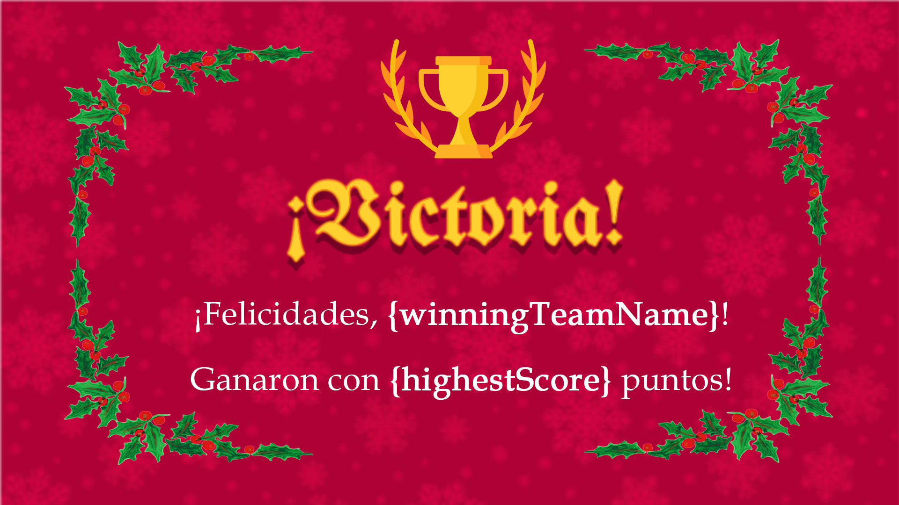

# **Juego Jeopardy Navideño**

🎄 Un juego de trivia festivo inspirado en el clásico Jeopardy! Diseñado para jugadores de todas las edade, este juego reúne a familiares y amigos durante la temporada navideña con categorías y preguntas que abarcan desde peliculas y canciones hasta historia y tradiciones de la Navidad.

## **Características**
- 🎅 **Equipos/jugadores personalizables**: elige la cantidad de jugadores o equipos antes de comenzar el juego.
- ✨ **Juego dinámico:**: Se actualiza automáticamente el turno del equipo actual, con un indicador visual de la interfaz de usuario.
- ❓ **Preguntas con temática navideña:**: Incluye 6 diferentes y divertidas categorías con tematicas navideña.
- ✅ **Validación de respuestas:**: Resalta las respuestas correctas e incorrectas con señales visuales.
- 🕒 **Temporizador:**: Mantiene el juego a un ritmo rápido con un temporizador de cuenta regresiva para responder preguntas.
- 🔄 **Robo de puntos:**: Los equipos pueden intentar robar puntos por las preguntas respondidas incorrectamente.
- 🎶 **Efectos de sonido:**: Efectos para las respuestas correctas e incorrectas personalizados y musica de fondo.
- 🖥️ **Plataforma**: Creada como una aplicación de PC que utiliza Unity para la implementación.

## **Screenshots del Juego**

### Inicio


### Tablero Juego


### Pregunta con opción multiple


### Robo de puntos


### Fin del Juego


---

## **Primeros pasos**

### Requisitos
- Unity (se recomienda la versión 2021.3 o posterior)
- Un sistema capaz de ejecutar Unity Editor
- Git instalado para clonar el repositorio

### Instalación
1. Clonar este repositorio en su computadora local:
   ```bash
   git clone https://github.com/your-username/christmas-jeopardy.git
2. Clonar este repositorio en su computadora local:
   - Inicie Unity Hub.
   - Haga clic en Abrir proyecto y seleccione la carpeta clonada.
3. Compile y ejecute el proyecto:
   - Vaya a Archivo > Configuración de compilación.
   - Seleccione su plataforma (PC, Mac o Linux).
   - Haga clic en Compilar y ejecutar.

---

## **Instrucciones de juego**

1. Configuración::
   - Ingrese la cantidad de jugadores o equipos al inicio.
    
2. Dinamica del Juego:
   - Los equipos se turnan para seleccionar categorías y responder preguntas.
   - Ganan puntos por las respuestas correctas.
   - Las respuestas incorrectas pasan al "Robo de puntos" para otros equipos.
    
3. Categorías:
   - Películas navideñas
   - Villancicos y más
   - Historia de la Navidad
   - Navidad en los libros
   - Navidad en el mundo
   - ¿Quién lo dijo? Versión navideña
    
4. Fin del juego:
   - El equipo con más puntos al final gana el juego.
   - ¡Celebra con tu familia y amigos!

---

## **Estructura del proyecto**
- Assets/: Contiene scripts del juego, elementos de la interfaz de usuario, sonidos y gráficos.
- Scripts/:
    - GameManager.cs: Maneja la lógica del juego, la puntuación y la administración de turnos.
    - UIManager.cs: Maneja las interacciones y actualizaciones de la interfaz de usuario.
    - AudioManager.cs: Controla los efectos de sonido.
    - QuestionManager.cs: Carga y administra preguntas y respuestas.
- Prefabs/: Componentes reutilizables del juego (por ejemplo, botones).
- Scenes/: Escenas de Unity para el menú del juego y el tablero principal del juego.

---

## **Tecnologías utilizadas**
- Unity: Motor de juego utilizado para el desarrollo.
- C#: lenguaje de programación para crear scripts de lógica de juegos.
- Adobe Photoshop: para diseñar la interfaz de usuario y los recursos visuales.

---

## **Licencia**
Este proyecto está licenciado bajo la licencia MIT. Consulte el archivo [LICENSE](LICENSE) para obtener más detalles.
